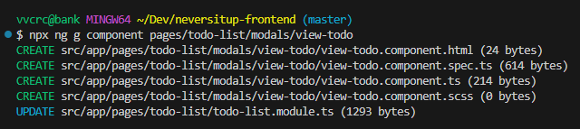
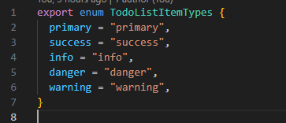

# Init project structure based on [ngx-admin](https://akveo.github.io/ngx-admin/)

## Convention

- Elements should be generated by the CLI to follow best practices and ensure consistency, as shown in the figure below.

- Variable should be readable and meaningful ex. **customer** rather than **c**.
- Avoid hard-code, eg., using enum or config instead.

- For custom file should be naming with {name}.{type}.{extension} for consistency, eg., todo-item.class.ts
- Any element should be separate into component for resuability and readability.
- Use git.
- Git commit message should be readable, meaningful and follow conventional commit guidelines, e.g., `feat: send confirmation email to customer after making a purchase`.
- master branch should be always work on production, should checkout feature branch from develop branch while in development process.
